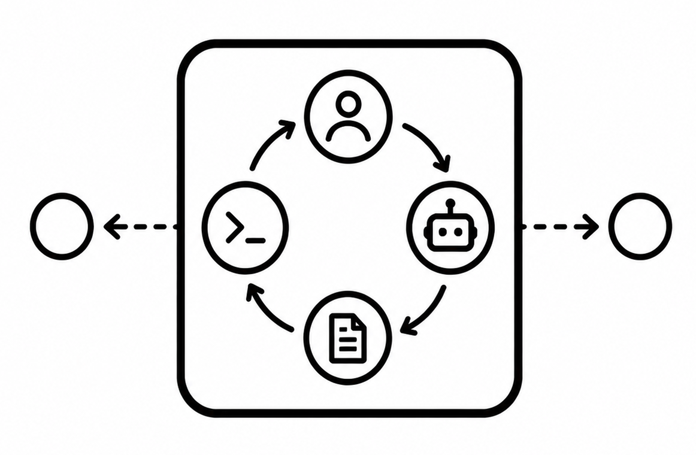

<p align="center">
  
</p>

<h1 align="center">AgentSync</h1>

<p align="center">
  <strong>AgentSync syncs your OpenCode sessions across every machine you work on.</strong><br>
  One command saves a session; one command brings it back on another — ready to continue exactly where you left off.
</p>

---

## Setup

### Prerequisites

- **git** — required; the sync transport is a plain git repo you own
- **Go ≥ 1.25** — only for building; installed automatically by `setup.sh` if missing
- **opencode** — runtime dependency; install the pinned version used for testing: `npm i -g opencode-ai@1.18.18` (a warning is printed if absent)

### Install (recommended)

```bash
git clone https://github.com/utkrshm/agentsync.git
cd agentsync
./setup.sh
```

`setup.sh` is idempotent and safe to re-run any time to update to the latest master (fast-forward only — it never force-updates your checkout):

- installs a system Go toolchain if none ≥ 1.25 is found
- keeps the source checkout at `~/.local/src/agentsync`
- builds two binaries into `~/.local/bin`: `agent-sync` (CLI) and `agent-sync-daemon` (real-time watcher)
- appends `~/.local/bin` to `PATH` in `~/.bashrc` if needed

Paths are overridable via environment variables: `AGENT_SYNC_REPO` (clone URL), `AGENT_SYNC_SRC` (checkout location), `AGENT_SYNC_BIN` (binary location).

### Install (manual)

```bash
git clone https://github.com/utkrshm/agentsync.git
cd agentsync
CGO_ENABLED=0 go build -o ~/.local/bin/agent-sync ./cmd/cli
```

### Quickstart

```bash
agent-sync init --repo git@github.com:you/your-session-repo.git --device-alias laptop
```

This creates `~/.config/agent-sync/config.toml`, initializes the sync repo (default `~/agent-sessions`), records a durable per-device UUID, and sets the origin remote. You're ready to send and receive.

## Usage

Three everyday scenarios. Run `agent-sync help <command>` (or `agent-sync <command> --help`) for everything else.

### First-time setup

```bash
agent-sync init [--repo <git-url>] [--device-alias <name>]
```

| Flag | Meaning |
|---|---|
| `--repo <url>` | Git remote storing synced sessions. Omitted: prompted interactively (blank answer = local-only). If already configured, you confirm keeping it. |
| `--device-alias <name>` | Display-only label shown in conflict/recovery reports. Never part of device identity. |

### Capture a session before leaving

```bash
agent-sync send <session-id>
```

Exports the OpenCode session, validates it, and stores it as an immutable, content-addressed revision:

```
opencode/<project-key>/sessions/<session-id>/revisions/<digest>.json
```

Re-sending identical content is a no-op; distinct revisions of the same session are preserved side by side. Every send produces a timestamped, versioned commit and pushes to origin.

### Pick up on another machine

```bash
agent-sync receive            # pull + safely restore pending sessions
agent-sync receive --dry-run  # preview what would be restored; change nothing
agent-sync pull               # fetch + fast-forward the sync repo only
```

`receive` fast-forward-pulls, then writes new exports back into local clones of the matching project — with a live-process guard, exact version pinning, and pre-restoration conflict detection. `pull` only updates the sync repo; it never touches tool storage.

> Other commands — `resume`, `index`, `revisions`, `conflicts`, `recover`, `migrate-layout` — are documented via `agent-sync help <command>`.

## Features

**Sync engine**

- Sessions live in a plain git repo you control — private GitHub/GitLab hosting, no server to run
- Projects identified canonically by git remote URL, so the same project at different paths on different machines stays one history
- Immutable, sha256-addressed revision artifacts — nothing is ever overwritten, and identical re-sends cost nothing
- Timestamped, versioned commits make the repo human-browsable

**Background & multi-machine**

- Silent, rate-limited auto-pull when you open a shell (`shell-init.sh`)
- Repo-index cache resolves which local clones should receive a restore — no filesystem scans on the hot path
- Restores broadcast across every local clone of the same project; busy clones retry automatically with backoff

**Safety by construction**

- Diverged history is refused — never force-pushed, never auto-merged
- Tool storage is never touched while that tool is running for the affected project (UID-scoped process check)
- Exact version pinning before any write-back; mismatches fail loudly
- `--dry-run` everywhere it matters; only `opencode/**` is ever staged or deleted

**Conflict handling**

- Multiple distinct revisions of one session are detected *before* any restore — they're archived, never silently merged or overwritten
- Explicit inspection: list revisions, report conflict groups
- Guided recovery: choose exactly one revision to bring back

## Roadmap

- [x] One-command setup backed by your own git storage
- [x] On-demand send / receive / pull of sessions between machines
- [x] One-shot resume: pull code, restore sessions, pick one to continue
- [x] Automatic pulls when you open a shell (silent, rate-limited trigger)
- [x] Immutable, content-addressed revisions — history is never overwritten
- [x] Same-session conflict detection, inspection, and guided recovery
- [x] Safety-first restore: live-process guard, exact version pinning, dry-run
- [x] Multi-clone aware restores across copies of the same project
- [ ] Watcher daemon for automatic session capture while you work
- [ ] Service-manager integration for the background daemon
- [ ] Interactive terminal UI to browse all synced sessions
- [ ] Full-text search across your entire session history
- [ ] Support for additional AI coding agents
- [ ] Friendlier status/health checks and error messages
